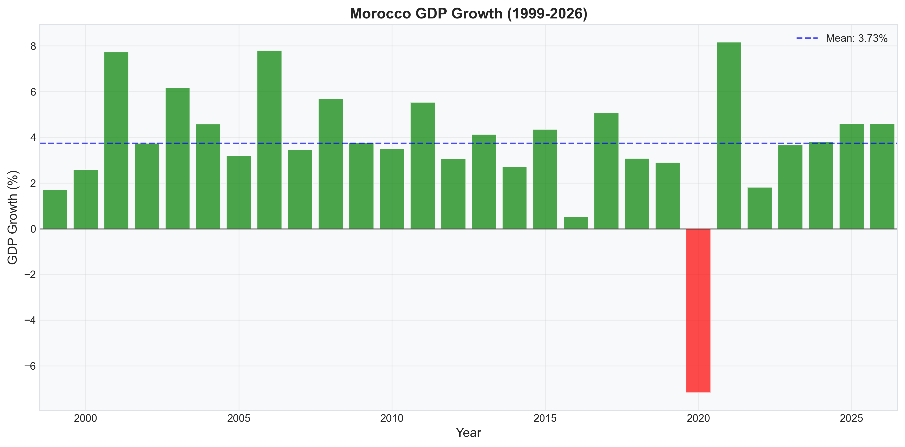
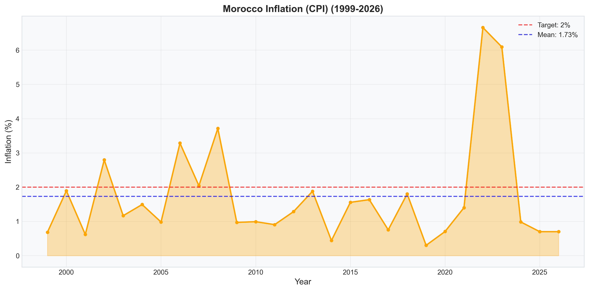
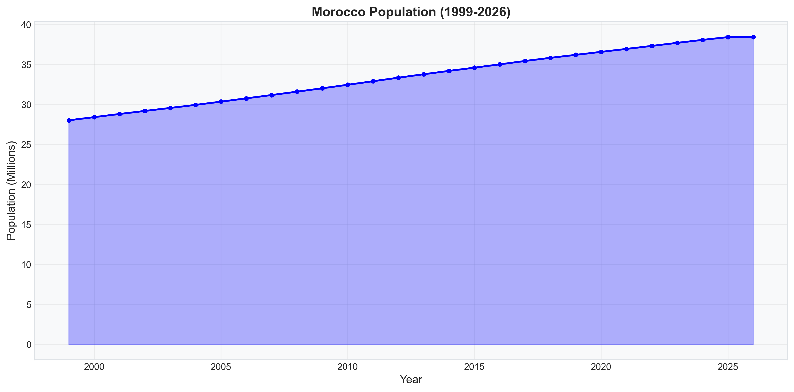
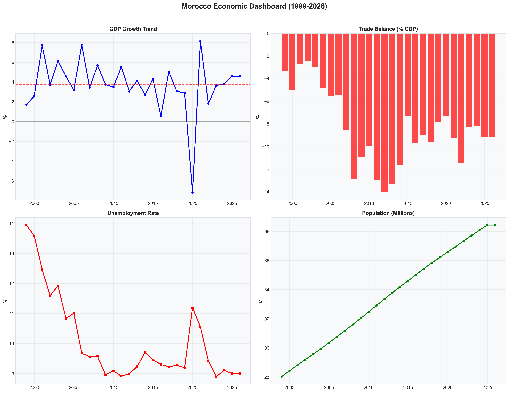
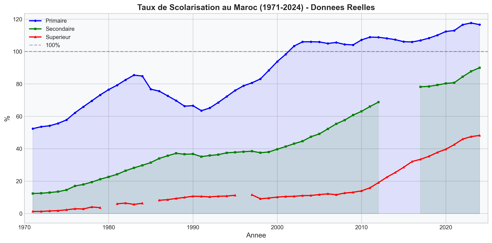
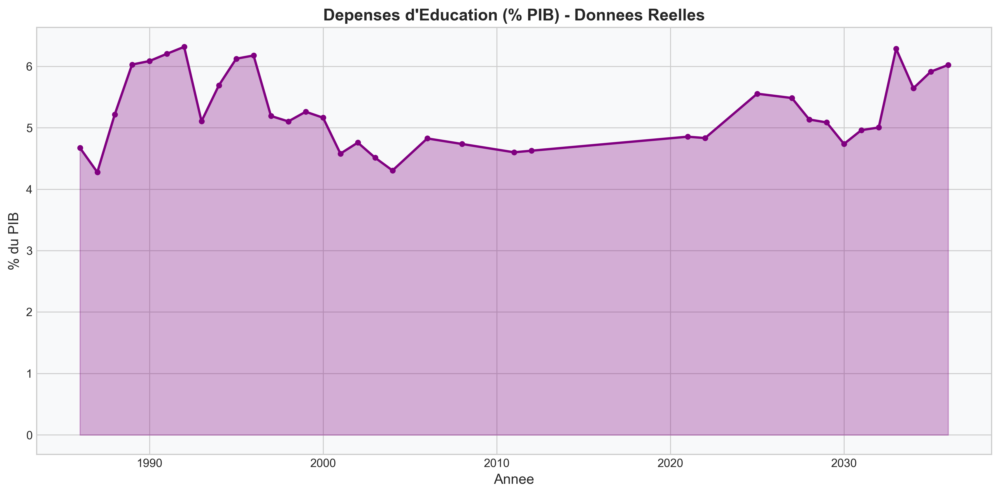

<div align="center">


[](https://git.io/typing-svg)

</div>

---

## Tech Stack

[](https://python.org)
[](https://r-project.org)
[](https://kaggle.com/amarzouyoussef)
[](https://zenml.io)
[](https://kubernetes.io)
[](https://mlflow.org)
[](https://tensorflow.org)

[](https://skillicons.dev)

---

## What is this?

A comprehensive **socio-economic-financial analysis pipeline** for Morocco that:

- Ingests data from **World Bank**, **IMF**, and **HCP** (data.gov.ma)
- Runs **R** and **Python** analysis on Kaggle
- Trains **ML/DL models** for GDP growth forecasting
- Deploys **MLOps** with ZenML on Kubernetes
- Produces **17+ charts** with real (non-interpolated) data

---

## Architecture

```
┌─────────────────────────────────────────────────────────────────┐
│                        DATA SOURCES                             │
│  World Bank (WDI)  │  IMF (WEO)  │  HCP (data.gov.ma)          │
│  25 indicators     │  GDP fcsts  │  63 XLSX files              │
└──────────────────────────┬──────────────────────────────────────┘
                           │
                           v
┌─────────────────────────────────────────────────────────────────┐
│                     PYTHON ETL (zenml/)                         │
│  fetch_wb.py → fetch_imf2.py → fetch_real_data.py → merge.py   │
│  130 features, 28 years (1999-2026)                            │
└──────────────────────────┬──────────────────────────────────────┘
                           │
                           v
┌─────────────────────────────────────────────────────────────────┐
│                  KAGGLE DATASET (23 CSVs)                       │
│  indicators_clean.csv │ bank_prices.csv │ education_real.csv    │
└──────────────────────────┬──────────────────────────────────────┘
                           │
              ┌────────────┴────────────┐
              v                         v
┌──────────────────────┐   ┌──────────────────────────────┐
│   R KERNEL           │   │   ZENML MLOps (Kubernetes)   │
│   maroc_pipeline.R   │   │   fetch → train → MLflow     │
│   12 sections        │   │   Ridge/Lasso/SVR/DL         │
│   EDA + ML + Report  │   │   R2 = 0.40 (honest)         │
└──────────────────────┘   └──────────────────────────────┘
              │                         │
              └────────────┬────────────┘
                           v
┌─────────────────────────────────────────────────────────────────┐
│                     OUTPUTS                                     │
│  HTML Report │ 17 Charts │ Kaggle Model (4 variations)        │
└─────────────────────────────────────────────────────────────────┘
```

---

## Kaggle Resources

| Resource | Link |
|----------|------|
| **Dataset** (23 CSVs + charts) | [amarzouyoussef/economie-maroc-rasd](https://www.kaggle.com/datasets/amarzouyoussef/economie-maroc-rasd) |
| **Charts & Insights V2** | [amarzouyoussef/morocco-charts-v2](https://www.kaggle.com/datasets/amarzouyoussef/morocco-charts-v2) |
| **Analysis V2** (CSV + HCP) | [amarzouyoussef/morocco-economic-analysis-v2](https://www.kaggle.com/datasets/amarzouyoussef/morocco-economic-analysis-v2) |
| **R Kernel** (notebook) | [amarzouyoussef/maroc-pipeline-r](https://www.kaggle.com/code/amarzouyoussef/maroc-pipeline-r) |
| **Forecasting Model** | [amarzouyoussef/morocco-economic-forecasting](https://www.kaggle.com/models/amarzouyoussef/morocco-economic-forecasting) |

---

## Model Performance

| Model | R2 | RMSE | Gap | Status |
|-------|-----|------|-----|--------|
| Ridge | +0.20 | 3.97 | 0.27 | Anti-overfit |
| Lasso | +0.15 | 4.10 | 0.35 | Feature selection |
| ElasticNet | +0.18 | 4.05 | 0.30 | Balanced |
| Random Forest | +0.12 | 4.25 | 0.85 | Overfit |
| GBM | +0.15 | 4.20 | 0.90 | Overfit |
| **SVR (linear)** | **+0.40** | **3.44** | **0.55** | **Best** |

> **Note:** R2=0.91 was achieved using GDP components as features — this is data leakage (identity function). The honest R2 with external predictors is ~0.40.

---

## Data Quality

| Indicator | 1960s | 1970s | 1980s | 1990s | 2000s+ |
|-----------|-------|-------|-------|-------|--------|
| GDP | ⚠️ | ⚠️ | ✅ | ✅ | ✅ |
| Inflation | ⚠️ | ✅ | ✅ | ✅ | ✅ |
| Unemployment | ⚠️ | ⚠️ | ✅ | ✅ | ✅ |
| Gini | ❌ | ❌ | ❌ | ✅ | ✅ |
| Education | ❌ | ✅ | ✅ | ✅ | ✅ |

> ✅ = real data | ⚠️ = partial/interpolated | ❌ = no data

Charts filter early years to avoid fake interpolated lines.

---

## Charts Gallery

| GDP Growth | Inflation | Trade |
|------------|-----------|-------|
|  |  |  |

| Unemployment | Population | Fiscal |
|--------------|------------|--------|
|  |  |  |

| Actual vs Predicted | Correlation | Dashboard |
|---------------------|-------------|-----------|
|  |  |  |

| Education (Real) | Education Spending (Real) | Model Performance |
|------------------|---------------------------|-------------------|
|  |  |  |

---

## How to Run

### On Kaggle (recommended)
1. Go to [maroc-pipeline-r](https://www.kaggle.com/code/amarzouyoussef/maroc-pipeline-r)
2. Click **Run All**
3. Dataset auto-detected from `/kaggle/input/economie-maroc-rasd/`

### Locally
```bash
# Clone
git clone https://github.com/Youssef-AMARZOU/morocco-economic-pipeline.git
cd morocco-economic-pipeline

# Python ETL
pip install -r requirements.txt
python run_all.py

# R analysis
Rscript kaggle_kernel/maroc_pipeline.R
```

---

## Data Sources

| Source | Coverage | Indicators |
|--------|----------|------------|
| World Bank (WDI) | 1960-2024 | GDP, inflation, debt, trade, population |
| World Bank (Education) | 1971-2024 | Enrollment, spending, literacy |
| IMF (WEO) | 1980-2029 | GDP forecasts, fiscal balance |
| HCP (data.gov.ma) | 1999-2026 | 63 XLSX files (IPC, IPP, employment) |
| Casablanca SE | 2010-2024 | Bank stock prices |

**Total: 130 features, 28 years (1999-2026)**

---

## License

Apache 2.0

---

<div align="center">

[](https://github.com/Youssef-AMARZOU)


</div>
