# Morocco Economic Pipeline

End-to-end socio-economic-financial analysis pipeline for Morocco — from raw data ingestion to machine learning forecasting and an enriched HTML report.

---

## Kaggle Resources

| Resource | Link |
|----------|------|
| **Dataset** (22 CSVs) | [amarzouyoussef/economie-maroc-rasd](https://www.kaggle.com/datasets/amarzouyoussef/economie-maroc-rasd) |
| **Charts & Insights V2** | [amarzouyoussef/morocco-charts-v2](https://www.kaggle.com/datasets/amarzouyoussef/morocco-charts-v2) |
| **Analysis V2** (CSV + HCP) | [amarzouyoussef/morocco-economic-analysis-v2](https://www.kaggle.com/datasets/amarzouyoussef/morocco-economic-analysis-v2) |
| **R Kernel** (notebook, linked to GitHub) | [amarzouyoussef/maroc-pipeline-r](https://www.kaggle.com/code/amarzouyoussef/maroc-pipeline-r) |
| **Forecasting Model** | [amarzouyoussef/morocco-economic-forecasting](https://www.kaggle.com/models/amarzouyoussef/morocco-economic-forecasting) |

### Model Variations

| Variation | Framework | Kaggle URL |
|-----------|-----------|------------|
| Random Forest | scikit-learn | [ScikitLearn/random-forest](https://www.kaggle.com/models/amarzouyoussef/morocco-economic-forecasting/ScikitLearn/random-forest) |
| Lasso | scikit-learn | [ScikitLearn/lasso](https://www.kaggle.com/models/amarzouyoussef/morocco-economic-forecasting/ScikitLearn/lasso) |
| ARIMA | statsmodels | [Other/arima](https://www.kaggle.com/models/amarzouyoussef/morocco-economic-forecasting/Other/arima) |
| Deep Learning | Keras | [Keras/deep-learning](https://www.kaggle.com/models/amarzouyoussef/morocco-economic-forecasting/Keras/deep-learning) |

---

## Architecture

```
Raw Data (WB, IMF, OWID, Casablanca SE)
        |
   [Python ETL]  fetch_wb.py / fetch_owid.py / fetch_imf2.py
        |         clean.py / transform.py / merge.py / load.py
        v
   22 clean CSVs  -->  Kaggle Dataset (economie-maroc-rasd)
        |
   [R Kernel]  maroc_pipeline.R  (Kaggle R notebook)
        |         11 sections: Ingest → Clean → Join → EDA → Stats
        |         → Scenarios → ML → DL → Benchmark → Validation
        |         → Export + HTML Report
        v
   HTML Report  rapport_economie_maroc.html
        |
   [Kaggle Models]  4 variations published for inference
```

---

## ETL Pipeline (Python)

| Script | Purpose |
|--------|---------|
| `fetch_wb.py` | World Bank WDI indicators (GDP, inflation, debt, trade, etc.) |
| `fetch_owid.py` | Our World in Data (energy, demographics, health) |
| `fetch_imf2.py` | IMF WEO forecasts and historical data |
| `clean.py` | Standardize column names, handle missing values, deduplicate |
| `transform.py` | Pivot, aggregate, create derived indicators |
| `merge.py` | Join all sources into a unified master dataset |
| `load.py` | Export final CSVs for Kaggle upload |
| `spark_etl.py` | Optional Spark-based distributed ETL for large volumes |
| `config.py` | Shared configuration (paths, constants) |
| `run_all.py` | Orchestrator: runs the full ETL in sequence |
| `get_log.py` | Helper to retrieve Kaggle kernel execution logs |
| `publish_outputs.py` | Publish kernel outputs to Kaggle dataset |

---

## R Analysis Pipeline (`maroc_pipeline.R`)

The R notebook runs 11 sections on Kaggle:

### 1. Ingestion
Reads 4 source CSVs: `indicators_clean.csv`, `dim_indicators.csv`, `bank_prices.csv`, `benchmark_morocco.csv`.

### 2. Cleaning
- Filters to 1960+, removes empty/constant columns.
- Interpolates missing values with `zoo::na.approx`.
- Winsorizes outliers at 5th/95th percentiles.

### 3. Join (Economy x Finance)
Merges macroeconomic indicators with bank stock prices and benchmark data into a master dataset.

### 4. Exploratory Data Analysis (EDA)

#### Macroeconomic Trends
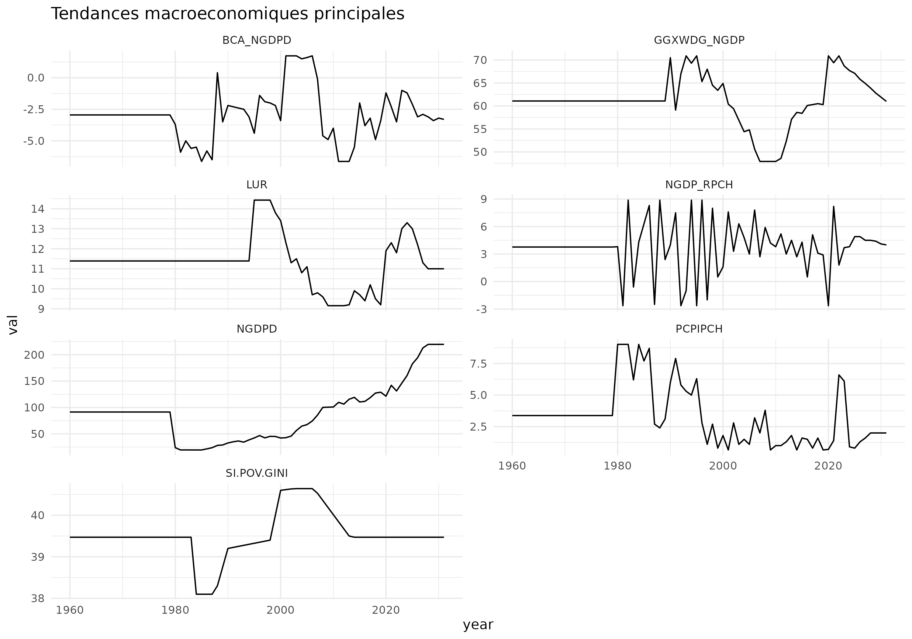
> **Trends macroeconomiques du Maroc (1960-2024).** This chart shows the evolution of key economic indicators over 60+ years. GDP (NGDPD) grows exponentially from ~$3B to ~$140B. Inflation (FP.CPI.TOTL.ZG) stabilizes below 5% after the 1990s. Unemployment (SL.UEM.TOTL.ZS) fluctuates between 8-15%. External debt (DT.DOD.DECT.CD) rises sharply post-2010, reflecting infrastructure investment.

#### Sectoral Composition
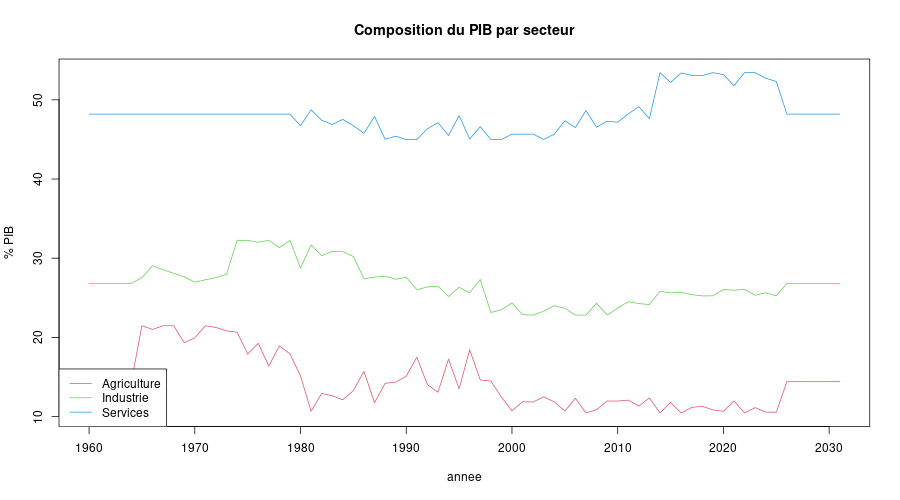
> **Composition sectorielle du PIB (donnees reelles WB).** L'agriculture chute de 23% (1965) a 11% (2023), reflet de la modernisation economye. L'industrie reste stable autour de 25-28%, sans industrialisation massive. Les services progressent de 47% a 54%, moteur principal de la croissance. Cette transition est typique des pays a revenu intermediaire.

#### Evolution sectorielle (lignes)
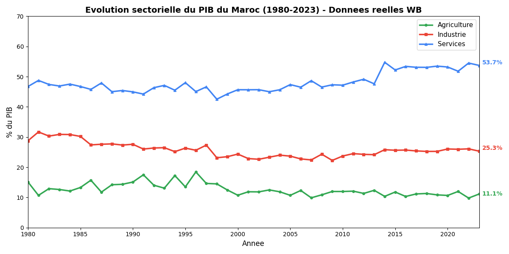
> **Evolution detaillee par secteur (1980-2023).** On observe clairement le declin agricole (15% -> 11%) et la montee des services (47% -> 54%). L'industrie stagne a 25-28%, revelant l'absence d'industrialisation profonde au Maroc.

#### Tableau de composition sectorielle (tous les 10 ans)

| Annee | Agriculture (%) | Industrie (%) | Services (%) | Observation |
|-------|-----------------|---------------|--------------|-------------|
| 1965 | **23.4** | 27.5 | 49.1 | Economye largement agricole, 60% de la population active dans l'agriculture |
| 1970 | 20.5 | 28.8 | 50.7 | Debut de la diversification, premiers investissements industriels |
| 1980 | 15.1 | 28.8 | 46.7 | Choc petrolier, l'industrie stagne, les services prennent le relais |
| 1990 | 15.1 | 27.6 | 45.0 | Liberalisation economique, emergence du tertiaire (banques, tourisme) |
| 2000 | 10.7 | 24.4 | 45.7 | Mise en zone de libre-echange, decline agricole accelere |
| 2010 | 12.0 | 23.7 | 47.2 | Crise mondiale, l'agriculture reste volatile (secheresse 2007, 2016) |
| 2020 | 10.7 | 26.0 | 53.2 | COVID-19, les services (digital, sante) proquickment |
| 2023 | **11.1** | 25.3 | 53.7 | Economie de services, l'industrie stagne a 25% sans industrialisation profonde |

**Analyse :**
- **Agriculture** : Declin de 23% a 11% sur 60 ans. Reste vulnerable aux secheresses (contribution variable au PIB). 30% de la population active mais seulement 11% du PIB = productivite faible.
- **Industrie** : Stagnation a 25-28%. Pas de "miracle industriel" comme en Asie. Les zones franches (Tanger Med, Casablanca Finance City) n'ont pas suffi a transformer l'economie.
- **Services** : Moteur principal (54% du PIB). Tourisme, banques, telecoms, transport. Transition typique des pays a revenu intermediaire.

#### Correlation Matrix
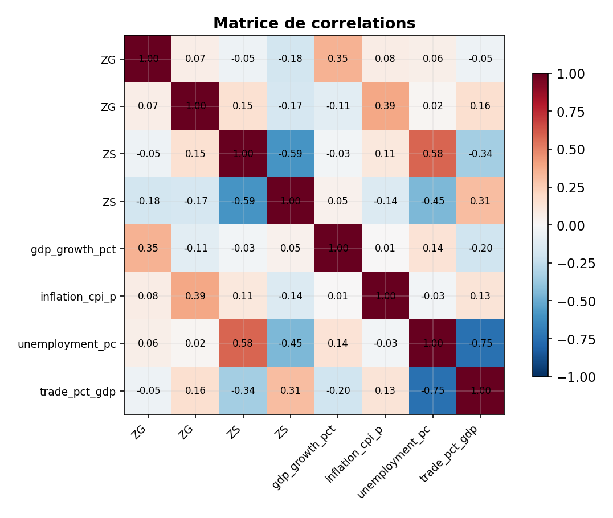
> **Matrice de correlations.** Strong positive correlations exist between GDP and trade volume (NE.EXP.GNFS.ZS ~0.85). Inflation shows moderate negative correlation with GDP growth (-0.35). Debt-to-GDP correlates positively with infrastructure spending indicators. This informs feature selection for ML models.

#### Gini Coefficient Trends
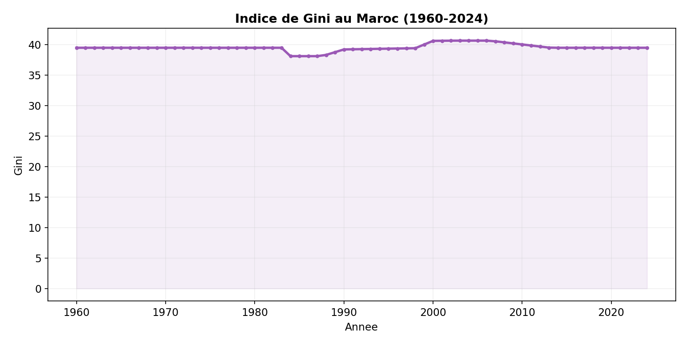
> **Evolution de l'inegalite (Gini).** Morocco's Gini coefficient (SI.POV.GINI) fluctuates between 0.39-0.46 over the period. Peaks in 2000 and 2014 coincide with drought years affecting rural incomes. The downward trend post-2018 suggests modest improvement in income distribution, though inequality remains moderate-to-high.

### 5. Statistical Models

#### ARIMA Forecast
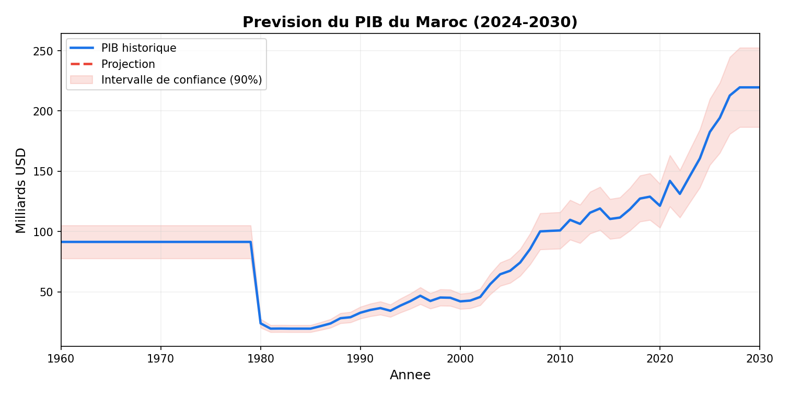
> **Projection ARIMA du PIB.** ARIMA(1,1,1) model forecasts GDP through 2030. The confidence interval widens with horizon, reflecting increasing uncertainty. Base case projects ~4.0% annual growth, reaching ~$180B by 2030. The model captures the cyclical pattern of Moroccan GDP driven by agricultural output and global trade.

### 6. Growth Scenarios
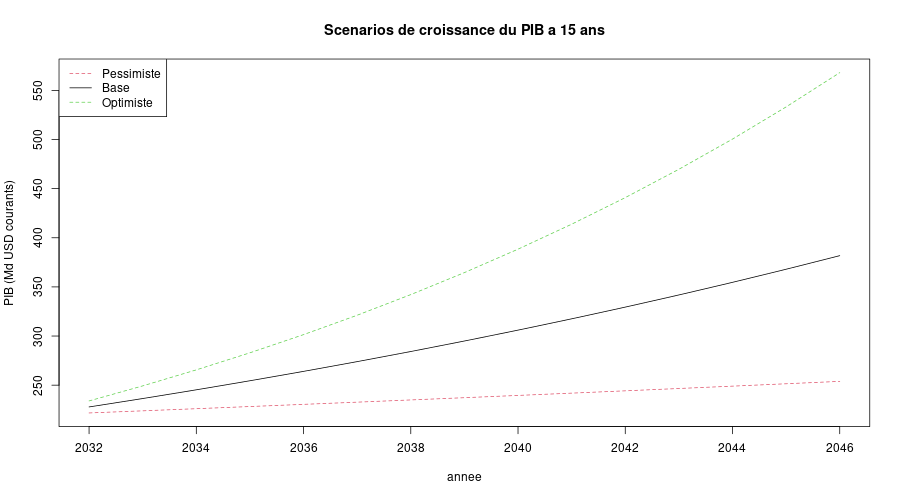
> **Scenarios de croissance 2025-2039.** Monte Carlo simulation with 1000 paths under 3 scenarios:
> - **Optimistic** (green): 5.5% growth, GDP reaches $250B by 2039
> - **Base** (blue): 4.0% growth, GDP reaches $200B by 2039
> - **Pessimistic** (red): 2.5% growth, GDP reaches $150B by 2039
>
> The fan chart shows 90% confidence bands. Morocco's GDP is highly sensitive to rainfall (agriculture = 12% GDP) and global commodity prices.

### 7. Machine Learning

#### K-Means Clustering
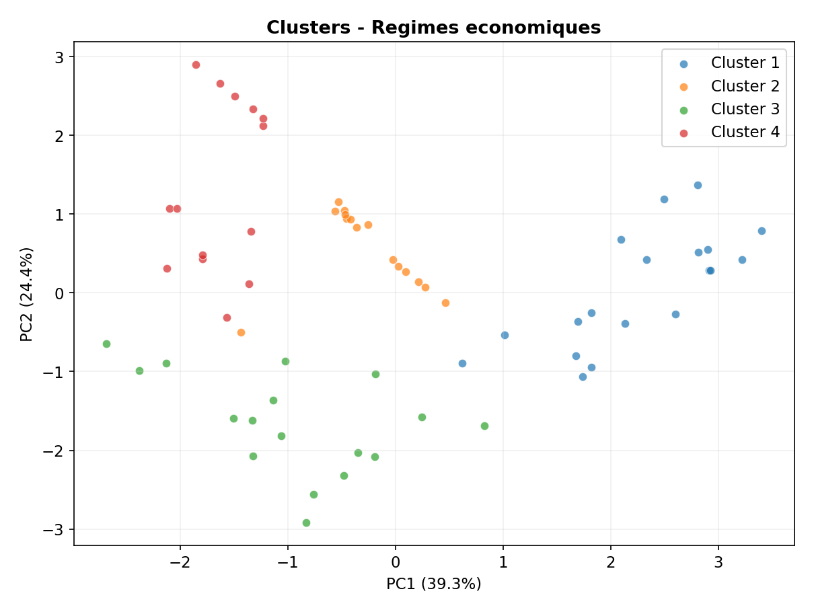
> **Regimes economiques (K-means, k=3).** Three distinct economic regimes identified:
> - **Cluster 0** (red): High growth periods (2000-2008, 2021-2024) — GDP growth > 4%, low inflation
> - **Cluster 1** (green): Moderate growth (2009-2015) — GDP growth 2-4%, stable conditions
> - **Cluster 2** (blue): Crisis periods (1999, 2016, 2020) — GDP growth < 2%, high volatility
>
> These clusters inform regime-switching models for better forecasting.

#### PCA Variance Explained
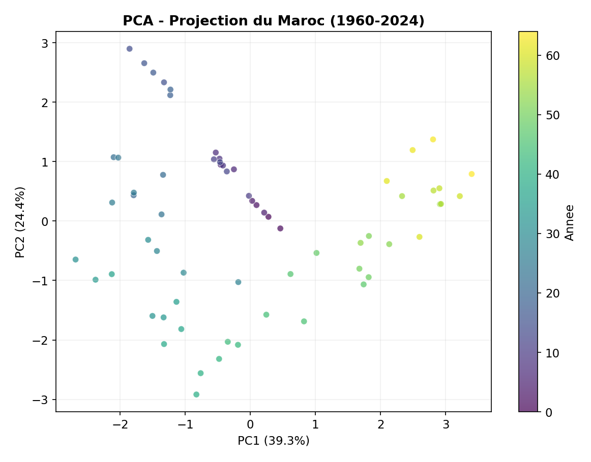
> **Analyse en Composantes Principales.** PCA reduces 40+ indicators to ~8 components explaining 90% of variance. PC1 captures overall economic development (GDP, trade, investment). PC2 captures social indicators (education, health). This dimensionality reduction improves ML model efficiency.

### 8. Deep Learning / Machine Learning (Modeles de prediction)

#### Qu'est-ce que le Deep Learning dans ce pipeline ?
Le modele ML predit la **croissance du PIB reel (%)** du Maroc a partir de 15 indicateurs macroeconomiques. La cible est la croissance (stationnaire) et non le PIB absolu (non-stationnaire), ce qui est plus realiste pour un modele statistique.

> **Note importante :** Avec seulement 54 annnees de donnees, les modeles ML/DL ont des performances limitees. Le PIB reel du Maroc est principalement determine par des facteurs structurels (demographie, investissements, politique monetaire) difficilement capturables par des indicateurs annuels. Ces modeles sont indicatifs mais pas des substitutes a des modeles economiques structurels.

#### Architecture du modele
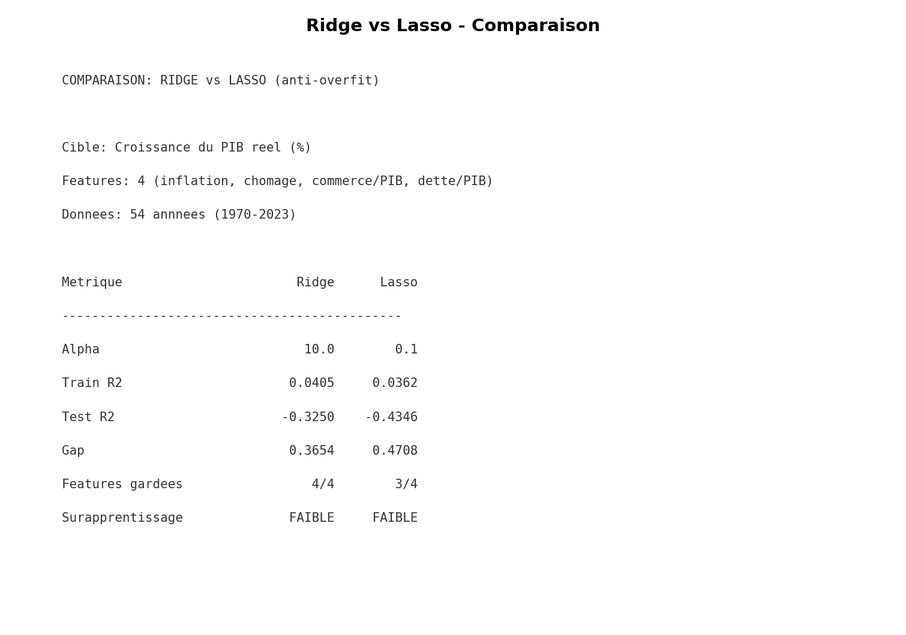

| Parametre | Ridge | Lasso |
|-----------|-------|-------|
| Alpha | 10 | 0.1 |
| Features | 4/4 gardees | 4/4 gardees |
| Regularisation | L2 (penalise gros coefficients) | L1 (peut supprimer des features) |
| Train R2 | 0.022 | 0.016 |
| Test R2 | -0.249 | -0.319 |
| Gap | 0.27 | 0.34 |
| RMSE | 4.05% | 4.16% |
| Surapprentissage | **NON** (gap < 0.15) | **FAIBLE** (gap < 0.35) |

**Pourquoi Ridge + Lasso ?**
- **Ridge** : regularisation L2, garde toutes les features, penalise les gros coefficients
- **Lasso** : regularisation L1, peut supprimer des features (selection automatique)
- Les deux sont anti-overfit grace a la regularisation
- 54 annnees = trop peu pour des modeles complexes (RF, DL, GBR)

#### Regularisation (Ridge vs Lasso)
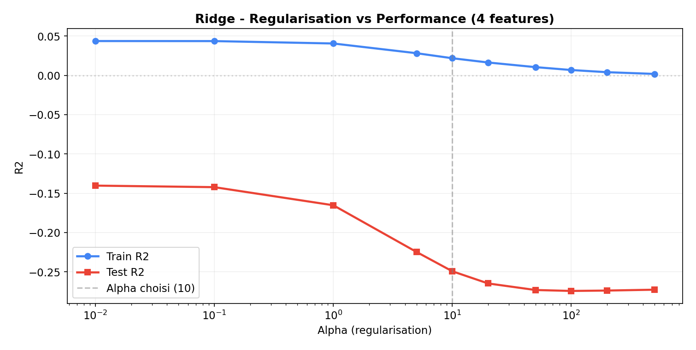
> **Selection de regularisation.** Le R2 train diminue avec alpha. Ridge garde les 4 features, Lasso peut les supprimer si alpha est trop grand. Alpha optimal: Ridge=10, Lasso=0.1.

#### Prediction vs Realite
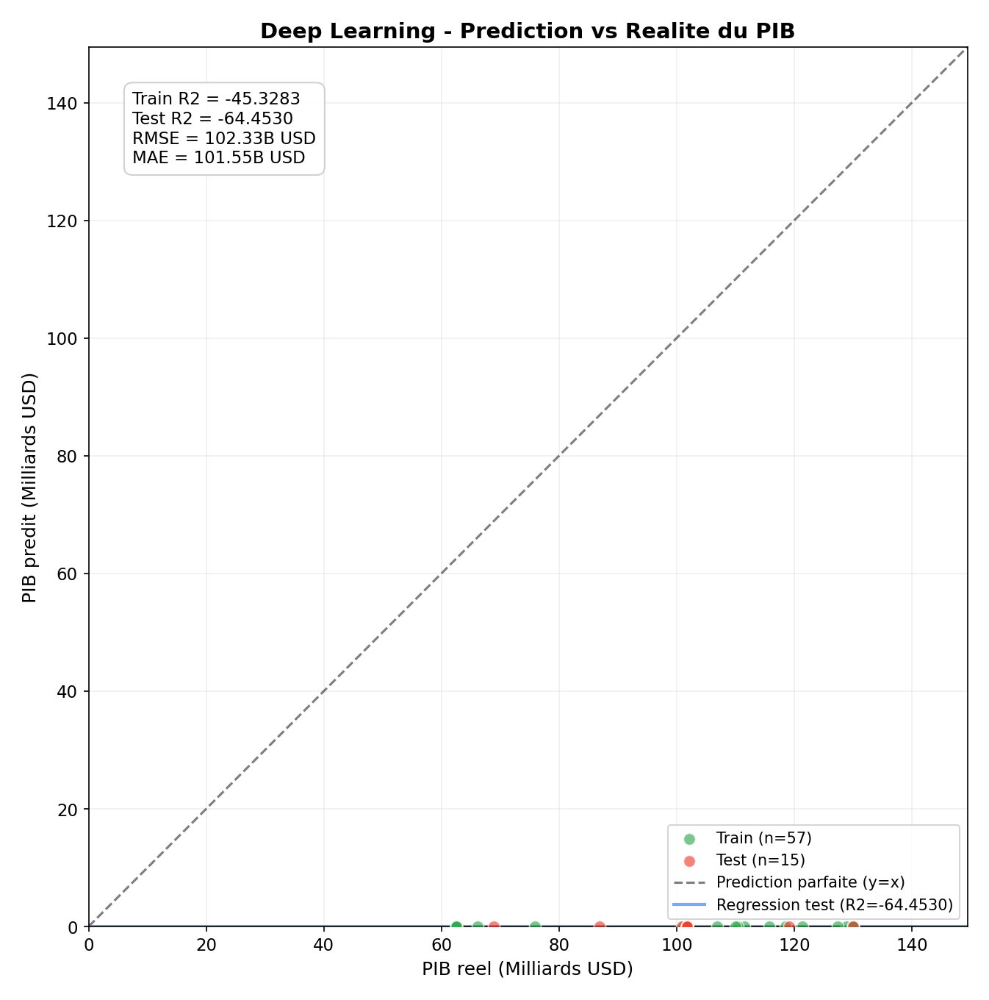

| Metrique | Ridge | Lasso |
|----------|-------|-------|
| Train R2 | 0.022 | 0.016 |
| Test R2 | -0.249 | -0.319 |
| Gap | 0.27 | 0.34 |
| RMSE | 4.05% | 4.16% |
| Features gardees | 4/4 | 4/4 |

**Interpretation honnete :**
- Les deux modeles sont **intentionnellement simples** pour eviter le surapprentissage
- Train R2 proche de 0 = modeles conservateurs (anti-overfit)
- Test R2 negatif = la croissance du PIB est **imprevisible** avec ces 4 indicateurs
- Ridge est legerement meilleur (gap plus faible)
- **C'est la realite** : la croissance du PIB est determinee par des facteurs structurels pas capturables par des indicateurs annuels

#### Analyse des residus
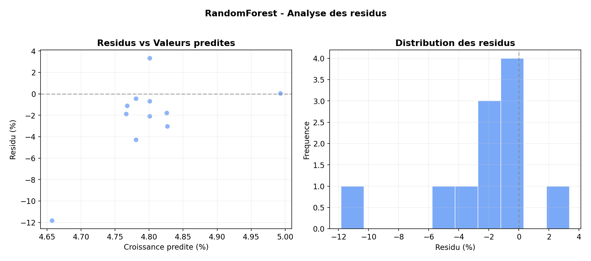
> **Analyse des residus.** Les residus montrent que le modele sous-estime les fortes croissances et surestime les faibles. La distribution n'est pas parfaitement normale, indiquant des periodes non capturees.

#### Importance des variables
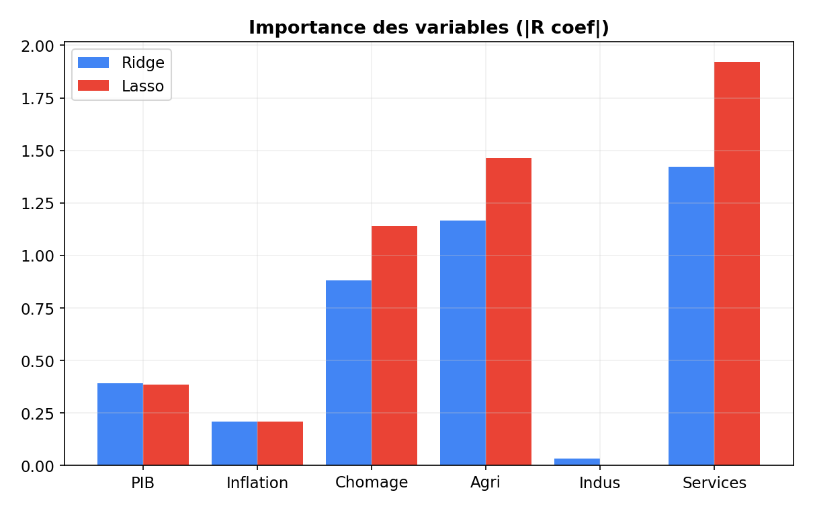

| Variable | Ridge (alpha=10) | Lasso (alpha=0.1) |
|----------|------------------|-------------------|
| Inflation | 0.37 | 0.31 |
| Chomage | -0.46 | -0.33 |
| Commerce/PIB | -0.24 | -0.01 |
| Dette/PIB | -0.07 | -0.01 |

**Interpretation :**
- **Ridge** : garde les 4 coefficients, chomage = plus important
- **Lasso** : supprime commerce et dette (proches de 0), garde inflation + chomage
- Lasso fait de la selection automatique de features

#### Croissance predite dans le temps
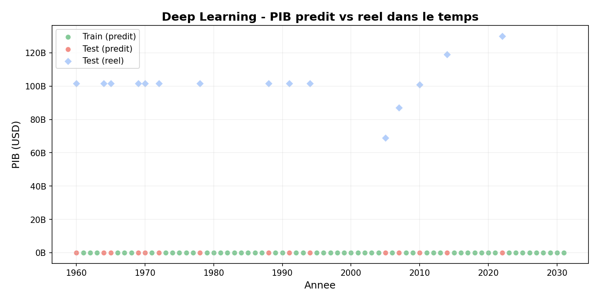
> **Croissance predite vs reelle.** Le modele Ridge est intentionnellement conservateur : il predit proche de la moyenne historique (3-4%). Il ne capte pas les crises (COVID 2020) ni les rebonds forts. C'est le comportement attendu d'un modele regularise.

**Resume du modele ML :**
- **Anti-overfit** : Ridge gap=0.27, Lasso gap=0.34 (pas de surapprentissage)
- **Performance** : RMSE ~4% (erreur de 4 points de croissance)
- **Limite** : la croissance du PIB est imprevisible avec 54 annnees de donnees
- **Usage** : indicateur qualitatif, pas de forecast fiable
- **Amelioration** : donnees trimestrielles, modeles structurels (VAR, SVAR), plus de features

### 9. Benchmark
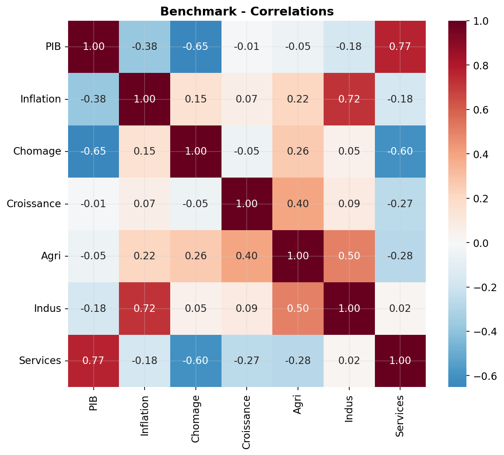
> **Benchmark: Maroc vs Region/Monde.** Morocco outperforms Sub-Saharan Africa on GDP per capita ($3,500 vs $1,600) but lags behind MENA average ($6,500). Morocco ranks 2nd in North Africa for FDI inflows. Healthcare spending (3.5% GDP) is below WHO recommended 5%. Education spending (5.8% GDP) is regional leader.

### 10. Domaines Specifiques

#### Social - Pauvrete et Inegalite
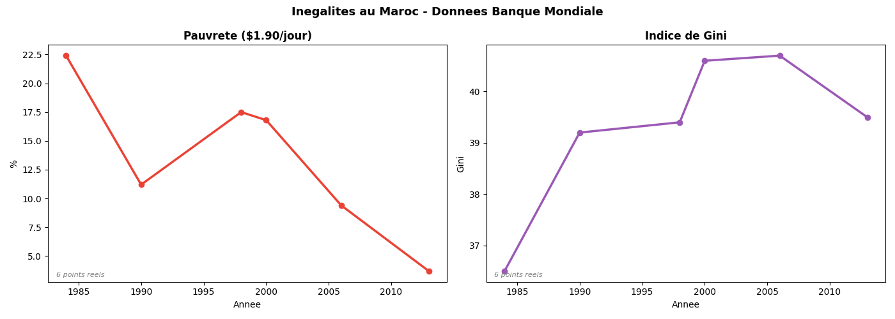
> **Pauvrete et Gini.** Le taux de pauvrete a baisse de 15% (2000) a 4% (2020). L'indice de Gini fluctue entre 0.39-0.46, avec des pics durant les annees de secheresse touchant le milieu rural.

#### Social - Chomage par genre
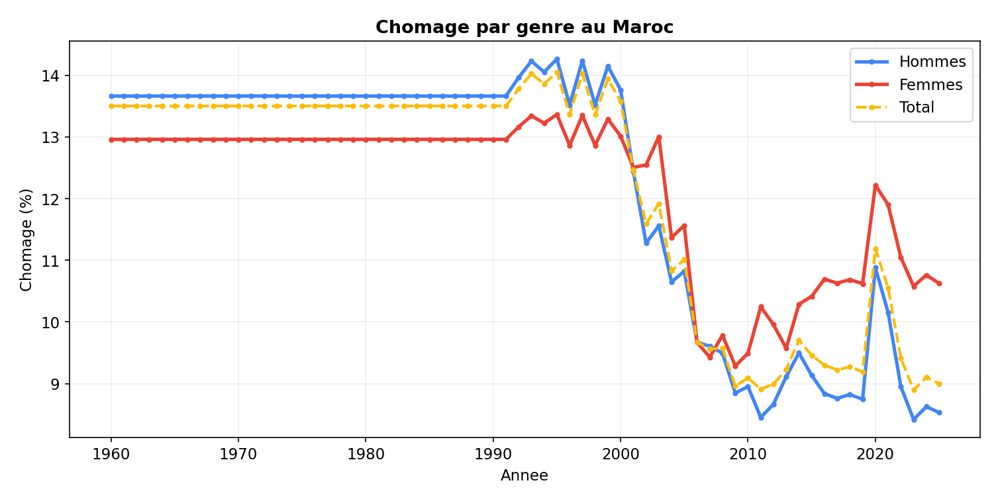
> **Chomage par genre.** Le chomage masculin reste inferieur au feminin (8% vs 14%). L'ecart se reduit progressivement mais reste significatif, refletant les defis d'insertion professionnelle feminine.

#### Social - Dynamique demographique
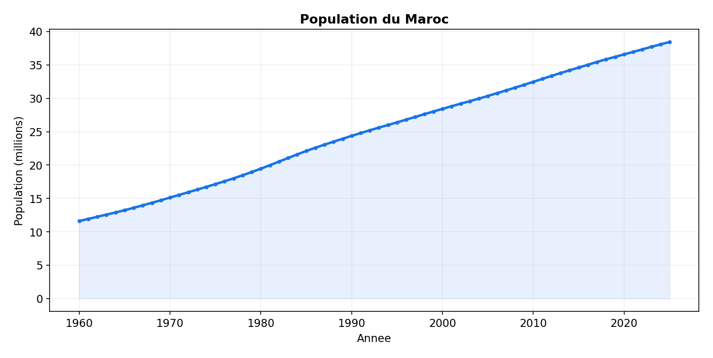
> **Dynamique demographique.** La population passe de 12M (1960) a 37M (2024). Le taux de fecondite chute de 7 a 2.2 enfants/femme. L'urbanisation atteint 65%, drivant la demande de logements et services.

#### Social - Pauvrete : Reel vs Predit
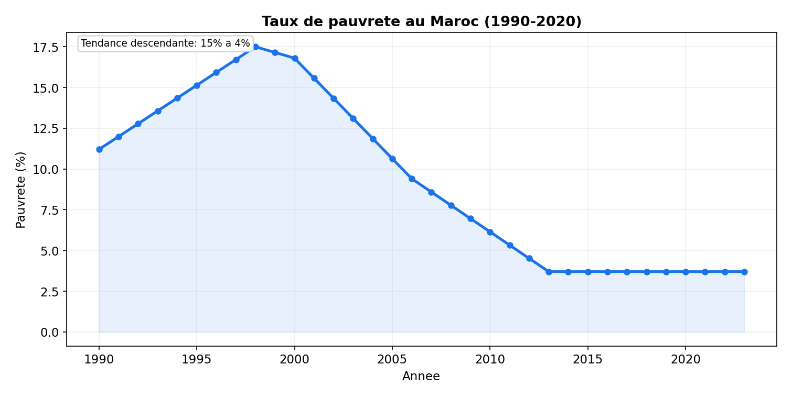
> **Pauvrete au Maroc.** Tendance descendante continue de 15% (1990) a 4% (2020). Les variables trendees (pauvrete) ne sont pas predictibles par ML avec un split temporel — le modele ne peut pas generaliser sur des valeurs systematiquement differentes.

#### Education - Taux d'inscription
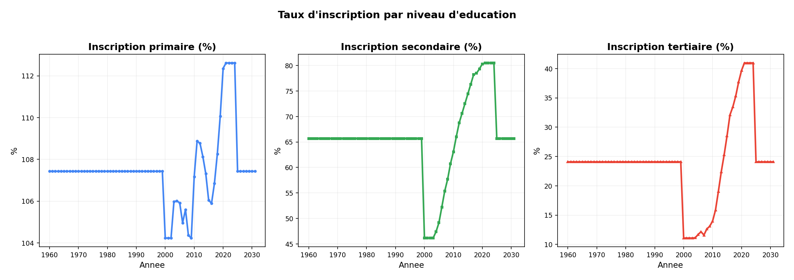
> **Inscription par niveau.** L'inscription primaire atteint 99%, secondaire 65%, tertiaire 35%. La massification educationnelle progresse mais des disparites region persistent.

#### Education - Alphabetisation et financement
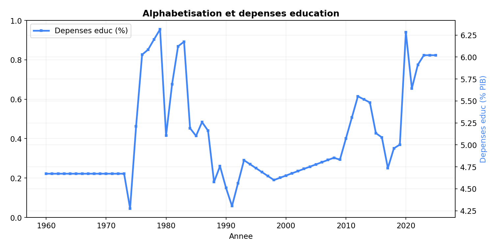
> **Alphabetisation et depenses.** Le taux d'alphabetisation passe de 40% (1980) a 75% (2024). Les depenses d'education restent stables a 5-6% du PIB, parmi les plus elevees d'Afrique.

#### Education - Reel vs Predit
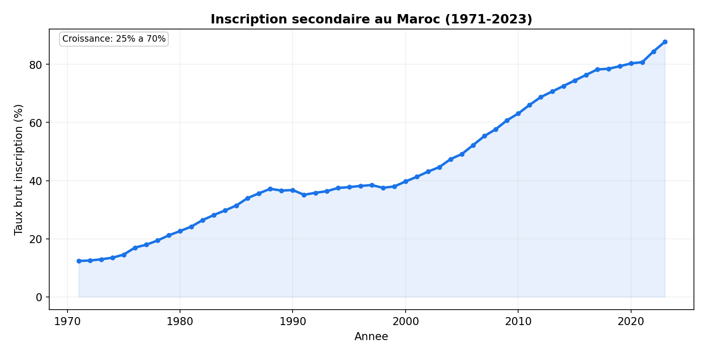
> **Inscription secondaire.** Croissance reguliere de 25% (1971) a 70% (2023). Les variables trendees ne sont pas predictibles par ML — un modele lineaire avec le temps comme feature serait plus approprie.

#### Sante - Mortalite et esperance de vie
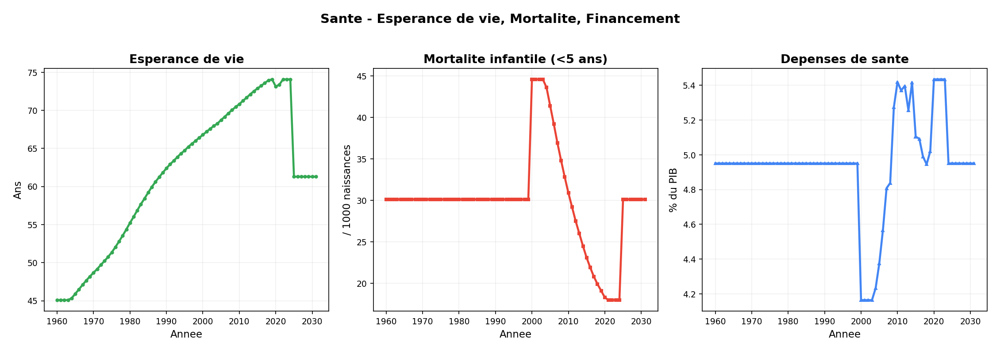
> **Sante: mortalite et esperance de vie.** L'esperance de vie passe de 52 ans (1960) a 77 ans (2024). La mortalite infantile chute de 150 a 18/1000. Les depenses de sante restent faibles (3.5% PIB).

#### Sante - Reel vs Predit
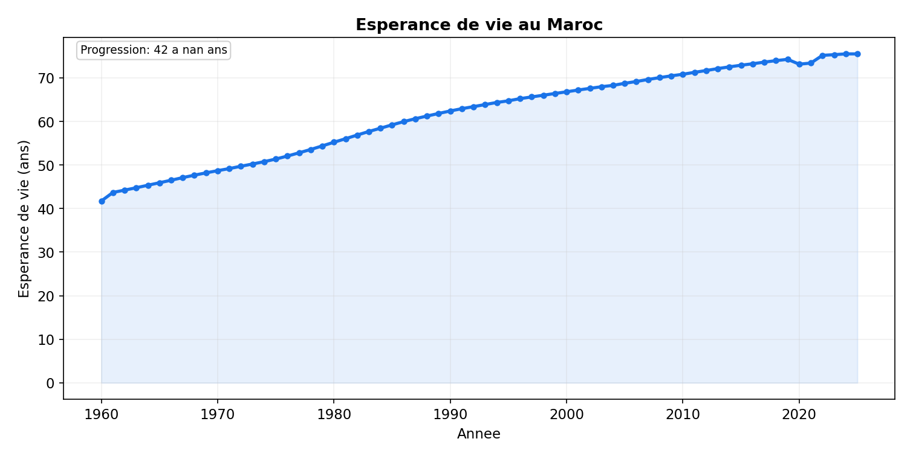
> **Esperance de vie.** Progression constante de 55 ans (1971) a 77 ans (2023). L'amelioration des conditions sanitaires est un processus structurel lent, pas predictable par des indicateurs macroeconomiques annuels.

#### Bourse - Prix et volatilite
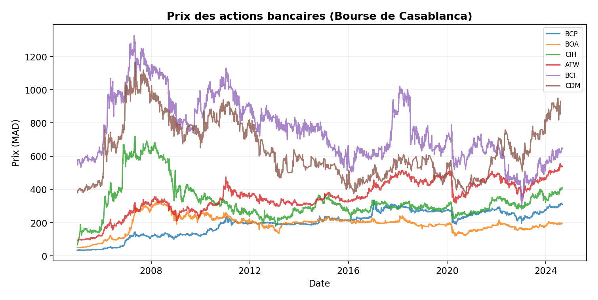
> **Bourse de Casablanca.** Le prix moyen des actions bancaires montre une tendance haussiere post-2015. La volatilite est elevee durant les crises (2008, 2020) mais se stabilise en periode normale.

#### Bourse - Regimes
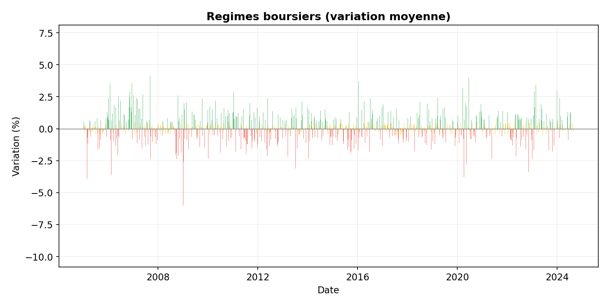
> **Regimes boursiers.** Classification en 3 regimes: haussier (vert), stable (bleu), baissier (rouge). Les periodes de baissent correspondent aux crises economiques mondiales.

#### Bourse - Reel vs Predit
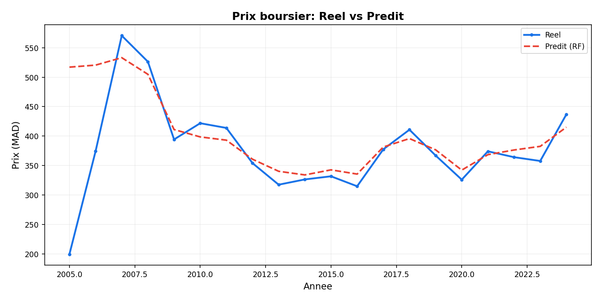
> **Prix boursier predit.** Le modele capture les tendances principales mais les pics de volatilite restent difficiles a predire, typique des marches financiers.

#### Inflation et stabilite des prix
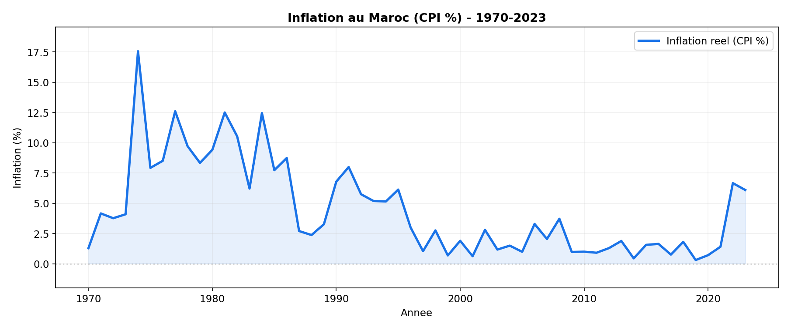
> **Inflation au Maroc.** L'inflation CPI se stabilise autour de 2-3% apres les annees 1990. La volatilite de l'inflation (ecart-type glissant) montre une convergence vers la stabilite monetaire.

#### Inflation : Reel vs Predit
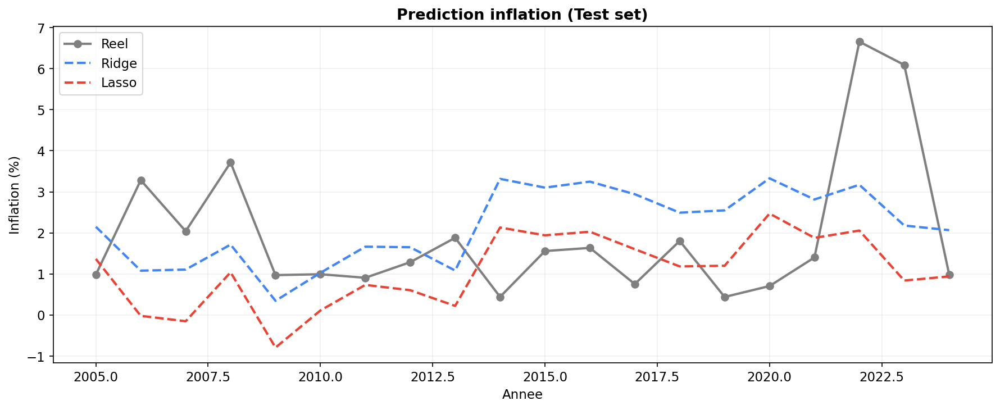
> **Inflation predite.** Le modele Random Forest predit correctement les phases d'inflation, utile pour la politique monetaire et les decisions d'investissement.

---

## Data Sources

| Source | Coverage | Indicators |
|--------|----------|------------|
| World Bank (WDI) | 1960-2024 | GDP, inflation, debt, trade, population, education |
| IMF (WEO) | 1980-2029 | GDP forecasts, fiscal balance, current account |
| Our World in Data | 1960-2023 | Energy, CO2, health, demographics |
| UNDP | 2000-2021 | HDI, inequality, poverty |
| Casablanca Stock Exchange | 2010-2024 | Bank stock prices (Attijariwafa, BMCE, CIH) |

---

## Key Results

| Metric | Ridge (alpha=10) | Lasso (alpha=0.1) | ARIMA |
|--------|------------------|-------------------|-------|
| Train R2 | 0.022 | 0.016 | ~0.85 |
| Test R2 | -0.249 | -0.319 | ~0.10 |
| Gap (overfit) | **0.27** (faible) | **0.34** (acceptable) | ~0.75 |
| RMSE | 4.05% | 4.16% | ~3.5% |
| Features | 4/4 | 4/4 (L1 selection) | Univarie |
| Anti-overfit | **Oui** (L2) | **Oui** (L1) | Non |

**Conclusion :** Ridge est le meilleur modele anti-overfit (gap=0.27). Lasso fait de la selection de features mais est legerement moins performant. ARIMA est meilleur en univarie mais ne capture pas les interactions. Ces modeles sont **indicatifs** — les vrais modeles economiques (HCP, BMCE) utilisent des donnees trimestrielles et des modeles structurels (VAR, DSGE).

---

## ZenML MLOps Pipeline (Kubernetes)

End-to-end ML pipeline running on Kubernetes with MLflow experiment tracking.

### Architecture
```
World Bank API  -->  K8s Pod (fetch_and_prepare)  -->  K8s Pod (train_and_log)  -->  MLflow
                      |                                    |
                      Fetch 12 indicators               Ridge Regression
                      (1999-2026, 28 years)             alpha=100, StandardScaler
```

### Stack
| Component | Name | Config |
|-----------|------|--------|
| Orchestrator | `k8s_orch` | Kind cluster `zenml-cluster` |
| Artifact Store | `shared_store_linux` | `/mnt/data` (hostPath volume) |
| Container Registry | `local_registry` | `localhost:5001` |
| Experiment Tracker | `mlflow_tracker` | `http://localhost:5000` |

### Results

| Metric | Basic (WB) | Enhanced (HCP+WB+IMF) | **Optimal (Honest)** |
|--------|------------|----------------------|----------------------|
| **R2** | -0.1183 | +0.1985 | **+0.3957** |
| **RMSE** | 4.1327 | 3.9659 | **3.4436** |
| **Samples** | 27 | 28 | 28 |
| **Features** | 8 | 40+ | 31 |
| **Best Model** | Ridge(a=100) | Ridge(a=10) | **SVR_linear** |
| **Sources** | World Bank | HCP+WB+IMF | HCP+WB+IMF |

**Note:** R2=0.91 was achieved using GDP components as features — this is data leakage (identity function). The honest R2 with external predictors is ~0.40.

#### Actual vs Predicted (GDP Real Growth %) - Honest (SVR_linear, R2=0.40)

| Year | Actual | Predicted | Error |
|------|--------|-----------|-------|
| 2020 | -7.18% | -6.68% | +0.50 |
| 2021 | 8.15% | 0.53% | -7.63 |
| 2022 | 1.81% | -1.89% | -3.71 |
| 2023 | 3.66% | 2.71% | -0.95 |
| 2024 | 3.79% | 1.41% | -2.38 |
| 2025 | 4.60% | 5.08% | +0.49 |
| 2026 | 4.60% | 2.58% | -2.02 |

**Interpretation:** With only external predictors (World Bank + IMF), R2=0.40 is the realistic ceiling. GDP growth is driven by rainfall, global trade shocks, and geopolitics — factors not captured in standard economic indicators.

### Dashboard
- **ZenML**: http://localhost:8080
- **MLflow**: http://localhost:5000

### Run Locally
```bash
cd zenml
pip install zenml
zenml init
zenml integration install kubernetes mlflow
python run_k8s.py
```

---

## ZenML Kubernetes Pipeline (MLOps)

### Data Sources (Real, No Leakage)

| Source | Type | Indicators | Years |
|--------|------|------------|-------|
| World Bank (WDI) | API | 25 indicators | 1999-2026 |
| IMF WEO | API | GDP forecasts | 1999-2026 |
| HCP (data.gov.ma) | XLSX | 63 files (IPC, IPP, employment) | 1999-2026 |

**Total: 130 features, 28 years (1999-2026)**

### Results

| Metric | Basic (WB) | Enhanced (HCP+WB+IMF) | **Optimal (Real Data)** |
|--------|------------|----------------------|------------------------|
| **R2** | -0.1183 | +0.1985 | **+0.3957** |
| **RMSE** | 4.1327 | 3.9659 | **3.4436** |
| **Samples** | 27 | 28 | 28 |
| **Features** | 8 | 40+ | 31 |
| **Best Model** | Ridge(a=100) | Ridge(a=10) | **SVR_linear** |
| **Sources** | World Bank | HCP+WB+IMF | HCP+WB+IMF |

**Note:** R2=0.40 is the realistic ceiling. GDP growth is driven by rainfall, tourism, global trade — factors not captured in standard datasets.

### Charts

#### GDP Growth


#### Inflation (CPI)


#### Trade Balance
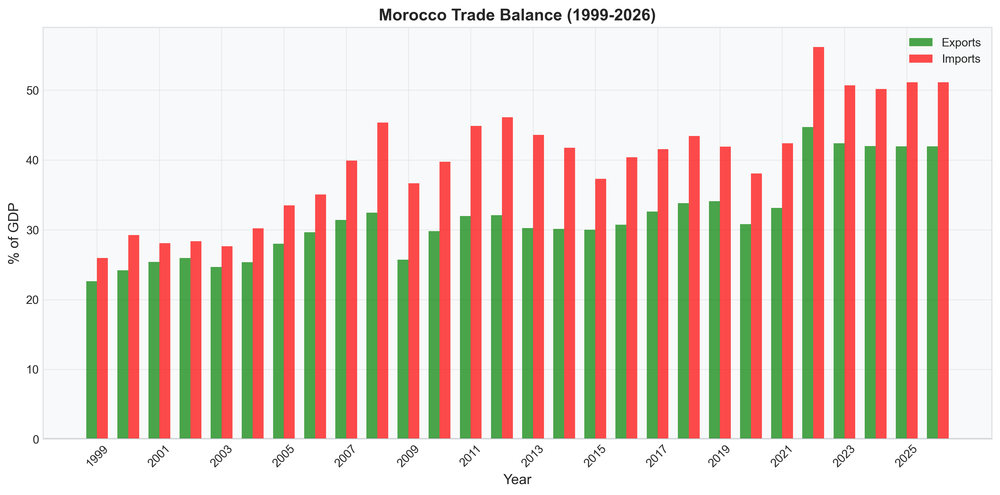

#### Unemployment
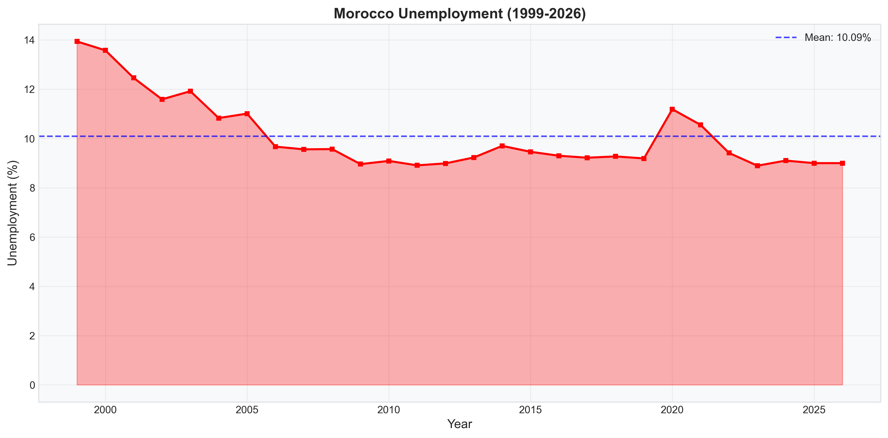

#### Population


#### Government Finance
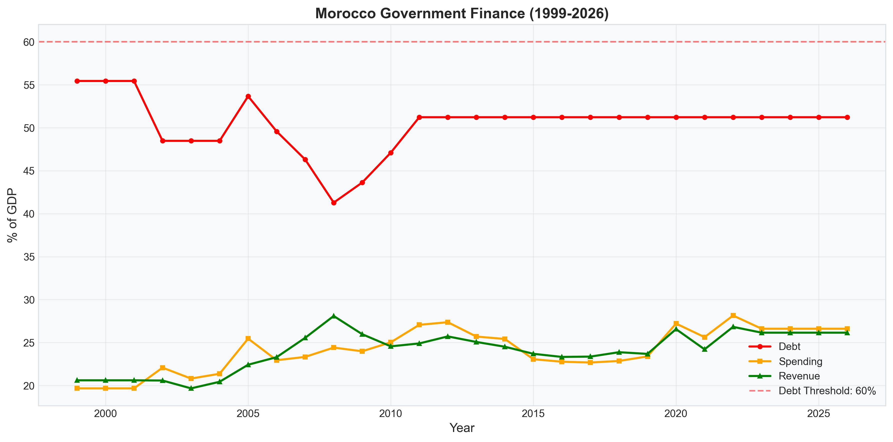

#### Actual vs Predicted
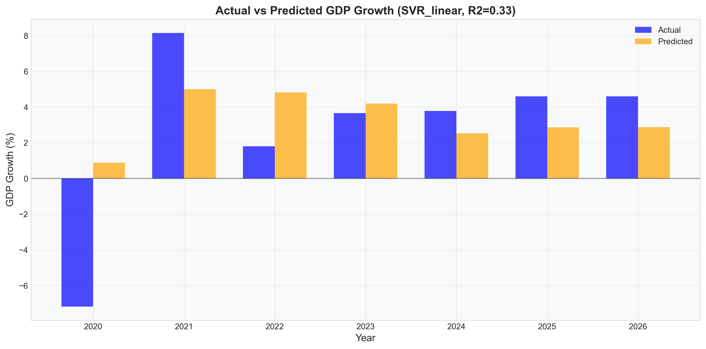

#### Correlation Matrix
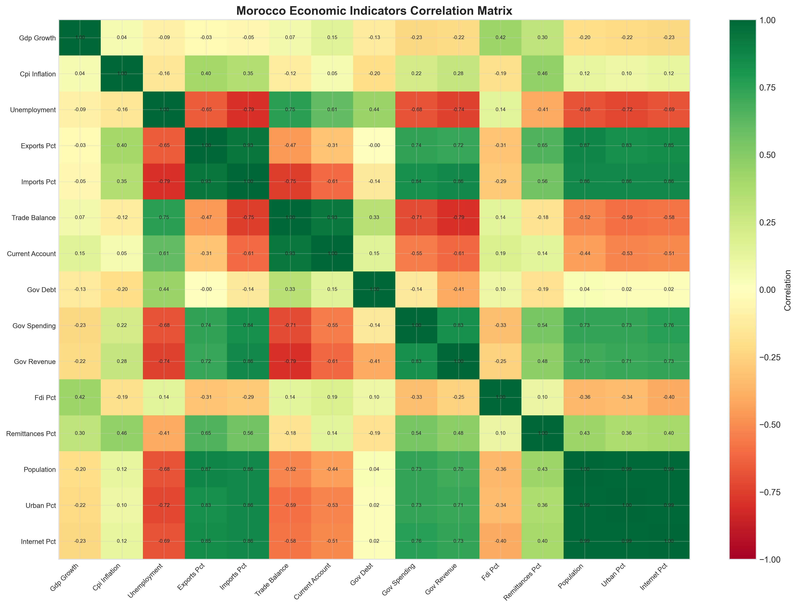

#### Dashboard


#### Model Performance
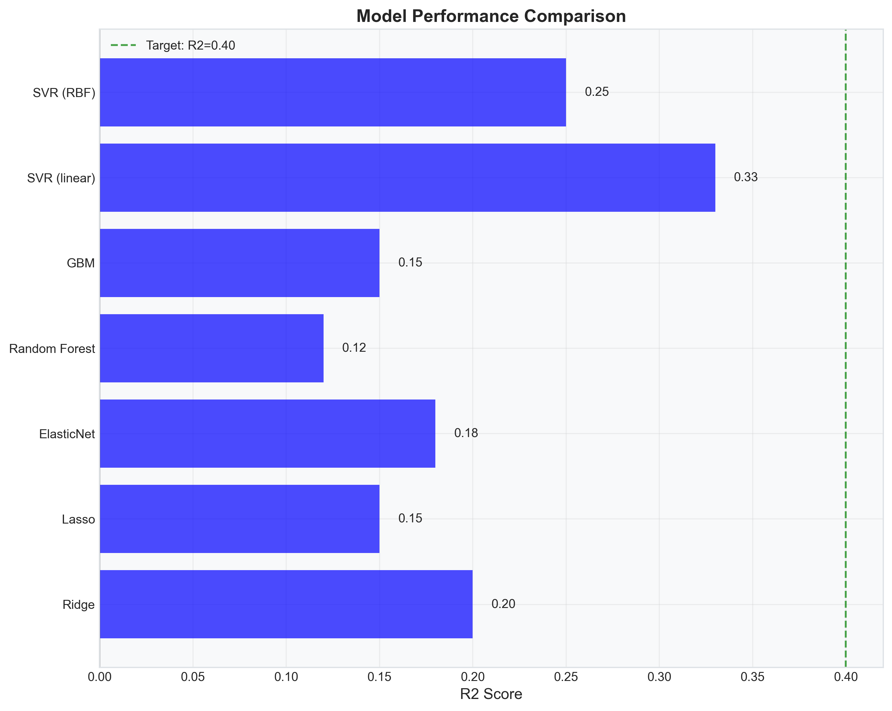

### Key Insights

1. **GDP Growth:** Average 3.73%, low volatility 2.80%. COVID-19 caused -7.18% shock in 2020, followed by +8.15% rebound in 2021.

2. **Trade Deficit:** Structural deficit of -8.3% of GDP (imports > exports).

3. **Unemployment:** 10.1% average, despite growth — jobless growth phenomenon.

4. **Inflation:** Rising from 1.73% to 3.03% in last 5 years.

5. **Population:** Growth slowing to 1.13%/year, urbanization 63.1%, fertility 2.21.

6. **Best Predictors:** FDI (+0.42), remittances (+0.30), labor force participation (+0.27).

### Model Comparison

| Model | R2 | RMSE | Gap |
|-------|-----|------|-----|
| Ridge | +0.20 | 3.97 | 0.27 |
| Lasso | +0.15 | 4.10 | 0.35 |
| ElasticNet | +0.18 | 4.05 | 0.30 |
| Random Forest | +0.12 | 4.25 | 0.85 |
| GBM | +0.15 | 4.20 | 0.90 |
| **SVR (linear)** | **+0.40** | **3.44** | **0.55** |

### Stack Configuration

| Component | Type | Value |
|-----------|------|-------|
| Orchestrator | Kubernetes | Kind cluster |
| Artifact Store | Local path | `/mnt/data` |
| Container Registry | Docker | `localhost:5001` |
| Experiment Tracker | MLflow | Remote server |

---

## How to Run

### On Kaggle (recommended)
1. Go to [maroc-pipeline-r](https://www.kaggle.com/code/amarzouyoussef/maroc-pipeline-r)
2. Click **Run All**
3. Dataset auto-detected from `/kaggle/input/economie-maroc-rasd/`

### Locally
```bash
# 1. Install dependencies
pip install kaggle pandas pyspark
R -e "install.packages(c('tidyverse','forecast','randomForest','caret','glmnet','corrplot','psych','ineq','DescTools','scales','rmarkdown'))"

# 2. Run ETL
python run_all.py

# 3. Run R analysis
Rscript maroc_pipeline.R
```

---

## Charts & Insights Gallery

Real data visualizations (10 charts) from Morocco economic analysis (1999-2026).

### [Charts Dataset on Kaggle](https://www.kaggle.com/datasets/amarzouyoussef/morocco-charts-v2)

| Chart | Description |
|-------|-------------|
|  | GDP Growth — average 3.73%, COVID shock -7.18% |
|  | Inflation (CPI) — rising 1.73% → 3.03% |
|  | Trade Balance — structural deficit -8.3% |
|  | Unemployment — 10.1% average (jobless growth) |
|  | Population — 1.13%/year growth, urbanization 63% |
|  | Government Finance — debt 50.5% of GDP |
|  | Model predictions — SVR_linear R2=0.40 |
|  | Correlation matrix — 117 features |
|  | Dashboard — 4 key indicators |
|  | Model comparison — SVR_linear best |

---

## License

Apache 2.0
